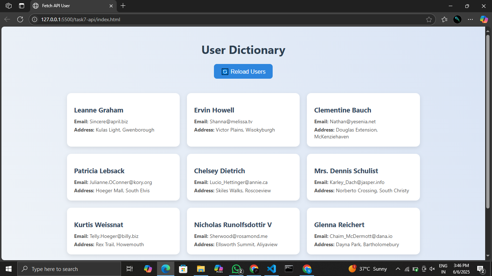

# 🚀 Fetch API User Data Webpage

This project demonstrates how to **fetch and display user data from a public API** using **JavaScript Fetch API**. It shows basic front-end skills including HTML, CSS, and JS integration.

---

## ✅ Features

- Fetches user data from a public REST API
- Displays name, email, and address of each user
- Uses `fetch()` and `async/await`
- Handles API/network errors
- Styled with responsive CSS
- Includes a **Reload Users** button to re-fetch data

---

## 🌐 API Used

> [https://jsonplaceholder.typicode.com/users](https://jsonplaceholder.typicode.com/users)

---

## 🛠 Technologies

- HTML5
- CSS3
- JavaScript (ES6)

---
## 📸 Preview

 

---

## 🔧 How to Run

1. Clone or download the project folder.
2. Open `index.html` in any modern browser.
3. You’ll see a list of users fetched from the API.
4. Click **🔄 Reload Users** to refresh the list.
5. Turn off your internet to test error handling.

